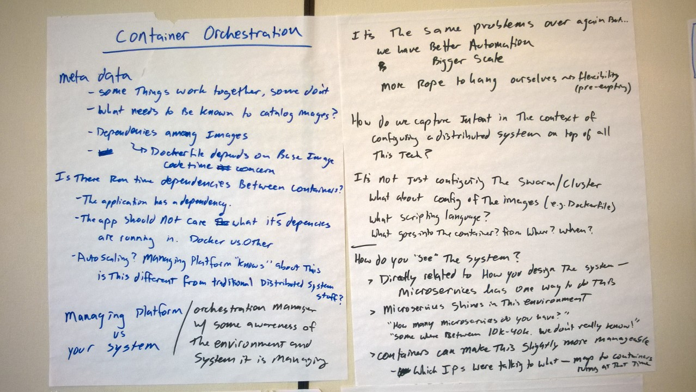
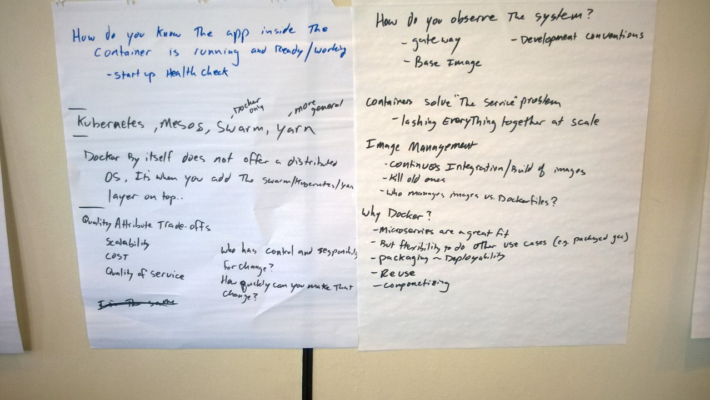
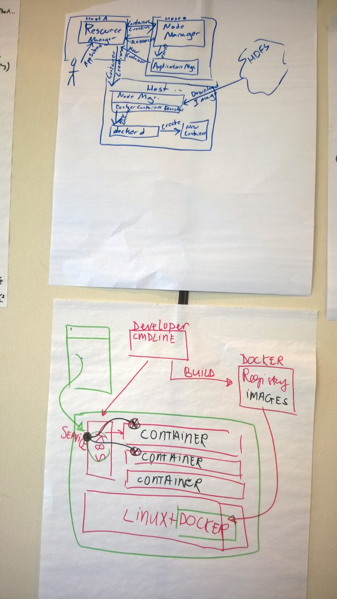

# Container Orchestration

Meta data

* Some things work together, some don’t.
* What needs to be known to catalog images?
* Dependencies among images. Dockerfile `FROM` for building on a base image is a build time dependency
* Are there run time dependencies between containers?
* The application has a dependency
* The app should not care what its dependencies are running - Docker vs other
* Auto scaling? Managing platofrm knows about this. Is this different from trandition distributed system stuff?

Managing platform - distribute orchestration manger awareness of the environment and the system it is managing.

How do you know the app inside the container is running and ready/working - start up health check

Kubernetes, Mesos, Swarm (Docker only), Yarn (more general)

Docker by itself does not offer a distributed OS; its when you add the Swarm/Kubernetes/Yarn layer on top.

Quality attribute trade offs: scalability, cost, quality of service, who has control and responsibility for change, how quickly can you make that change.

It's the same problems over agian how do we automate the scale of a deployment or schedule it?
We have better automation for implementing scheduling rules (e.g. YARN scheduler). Bigger scale. More rope to hang ourselves vs failibility (e.g. could pre-empt a container to free up space for a higher-priorty service but may not be a stable schedule solution)

How do we capture intent in the context of configuring a distributed system on top of all this tech?

Its not just configuration of the Cluster OS infrastructure. What about config of the images (e.g. Dockerfile running a configuration management tool instead of shell-script)

What about config of the software in the container images (e.g. baked-in, [Kubernetes Secrets](http://kubernetes.io/docs/user-guide/secrets/), distributed state synchronization like Zookeeper, etc.)

What scripting language

What goes into the container run when where

Do you see the system
* Directly related to how you design the system - microservices does one way to do 
* Microservices ?? in the environment
* “How many microservices do you have?” somewhere between 10K-40K, we don’t really know”
* Containers can make this slightly more manageable by isolating resource identifiers to specific services one-to-one
* Which iPs were likely to what - map to containers running

Patterns to observe the system connections:
* Gateway all requests must pass through
* Development conventions
  * Could be baked into base image
* Reverse engineer traffic flows

Containers solve “the service” problem - lashing everything together at scale

Image management
* Continuous integration/build of images
* Kill old ones
* Who manages images vs Dockerfiles

Why Docker? 
* Microservices are a great fit
* But flexibility to do other use cases e.g. packed compiler chain
* Packaging ~ deployability
* Reuse 
* Componentizing

The Future?

* Capturing the intent of configuration
* Understanding and taking action on scarce resources
* What is a scarce resource in the containers world?
* Time to market?
* Scarcity changes over time
* Challenge: implied expectations that may not be followed by the developer or application
* Orchestration key concerns:
   * Image repository
   * Startup 
* Health checks for startup time
* How to run a process?  How to do you keep it running?

